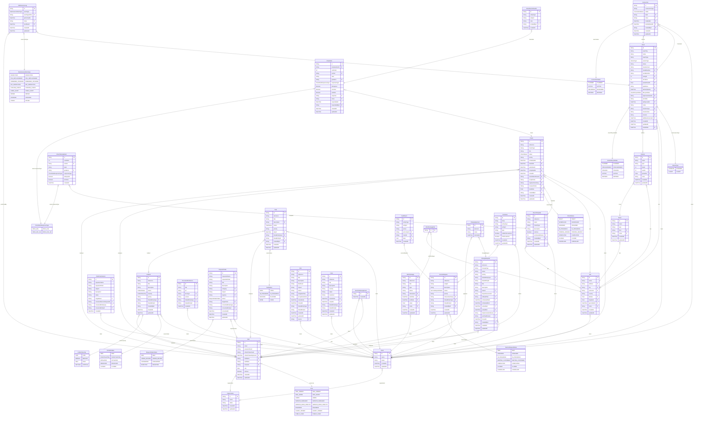

```mermaid
erDiagram

        Role {
            ORG_OWNER ORG_OWNER
ORG_ADMIN ORG_ADMIN
ADMIN ADMIN
SERVICE_MANAGER SERVICE_MANAGER
SERVICE_DESK_ANALYST SERVICE_DESK_ANALYST
ENGINEER ENGINEER
CLIENT_VIEWER CLIENT_VIEWER
PUBLIC_USER PUBLIC_USER
        }
    


        OwnerType {
            INTERNAL INTERNAL
CLIENT CLIENT
        }
    


        ServiceRequestStatus {
            NEW NEW
ASSIGNED ASSIGNED
IN_PROGRESS IN_PROGRESS
WAITING_CUSTOMER WAITING_CUSTOMER
COMPLETED COMPLETED
CLOSED CLOSED
CANCELLED CANCELLED
        }
    


        CheckStatus {
            DRAFT DRAFT
SCHEDULED SCHEDULED
ASSIGNED ASSIGNED
IN_PROGRESS IN_PROGRESS
PENDING_REVIEW PENDING_REVIEW
COMPLETED COMPLETED
CLOSED CLOSED
CANCELLED CANCELLED
        }
    


        CheckItemResponseType {
            PASS_FAIL PASS_FAIL
PASS_FAIL_NA PASS_FAIL_NA
        }
    


        IncidentStatus {
            NEW NEW
INVESTIGATING INVESTIGATING
MITIGATED MITIGATED
RESOLVED RESOLVED
CLOSED CLOSED
        }
    


        IncidentSeverity {
            LOW LOW
MEDIUM MEDIUM
HIGH HIGH
CRITICAL CRITICAL
        }
    


        TaskStatus {
            OPEN OPEN
IN_PROGRESS IN_PROGRESS
BLOCKED BLOCKED
DONE DONE
        }
    


        MaintenanceWorkType {
            INSPECTION INSPECTION
PSU_REPLACEMENT PSU_REPLACEMENT
FIRMWARE_UPGRADE FIRMWARE_UPGRADE
PAT_INSPECTION PAT_INSPECTION
COOLING_CHECK COOLING_CHECK
CABLE_AUDIT CABLE_AUDIT
REPAIR REPAIR
UPGRADE UPGRADE
OTHER OTHER
        }
    


        RequestIntakeStatus {
            NEW NEW
UNDER_REVIEW UNDER_REVIEW
CONVERTED CONVERTED
REJECTED REJECTED
        }
    


        AssetLifecycleState {
            PLANNED PLANNED
PROCUREMENT PROCUREMENT
STAGING STAGING
ACTIVE ACTIVE
RETIRED RETIRED
        }
    


        ConnectionStatus {
            PLANNED PLANNED
ACTIVE ACTIVE
DEGRADED DEGRADED
RETIRED RETIRED
        }
    
  "Client" {
    String id "🗝️"
    String name 
    String status 
    DateTime createdAt 
    DateTime updatedAt 
    }
  

  "Site" {
    String id "🗝️"
    String name 
    String address "❓"
    String city "❓"
    String postcode "❓"
    String country 
    Float latitude "❓"
    Float longitude "❓"
    DateTime geocodedAt "❓"
    String notes "❓"
    DateTime createdAt 
    DateTime updatedAt 
    }
  

  "Room" {
    String id "🗝️"
    String name 
    String type 
    String floor "❓"
    String notes "❓"
    DateTime createdAt 
    DateTime updatedAt 
    }
  

  "CheckTemplate" {
    String id "🗝️"
    String reference 
    String name 
    String checkType 
    String description "❓"
    Boolean isActive 
    Int estimatedMinutes "❓"
    String createdById "❓"
    DateTime createdAt 
    DateTime updatedAt 
    }
  

  "CheckTemplateItem" {
    String id "🗝️"
    Int sortOrder 
    String section "❓"
    String label 
    String guidance "❓"
    CheckItemResponseType responseType 
    Boolean isRequired 
    Boolean isCritical 
    DateTime createdAt 
    }
  

  "Check" {
    String id "🗝️"
    String reference 
    String checkType 
    String title 
    CheckStatus status 
    String priority 
    DateTime scheduledAt "❓"
    DateTime startedAt "❓"
    DateTime submittedAt "❓"
    DateTime completedAt "❓"
    DateTime closedAt "❓"
    String cancellationReason "❓"
    String scopeNotes "❓"
    String engineerSummary "❓"
    String reviewerNotes "❓"
    Float passRate "❓"
    String createdById "❓"
    DateTime createdAt 
    DateTime updatedAt 
    }
  

  "CheckItem" {
    String id "🗝️"
    String templateItemId "❓"
    Int sortOrder 
    String section "❓"
    String label 
    String guidance "❓"
    CheckItemResponseType responseType 
    Boolean isRequired 
    Boolean isCritical 
    Boolean isAdHoc 
    String response "❓"
    String notes "❓"
    DateTime respondedAt "❓"
    String respondedById "❓"
    DateTime createdAt 
    DateTime updatedAt 
    }
  

  "CheckItemFollowOn" {
    String id "🗝️"
    String entityType 
    String entityId 
    String note "❓"
    String createdById "❓"
    DateTime createdAt 
    }
  

  "Cabinet" {
    String id "🗝️"
    String name 
    String type 
    Int totalU "❓"
    Int usedU "❓"
    Float powerKw "❓"
    String notes "❓"
    DateTime createdAt 
    DateTime updatedAt 
    }
  

  "Organization" {
    String id "🗝️"
    String name 
    String status 
    DateTime createdAt 
    DateTime updatedAt 
    }
  

  "User" {
    String id "🗝️"
    String email 
    String passwordHash 
    String refreshTokenHash "❓"
    DateTime refreshTokenExpiresAt "❓"
    String firstName "❓"
    String lastName "❓"
    String knownAs "❓"
    Role role 
    Boolean isActive 
    DateTime createdAt 
    DateTime updatedAt 
    }
  

  "PublicSubmission" {
    String id "🗝️"
    String requesterName 
    String requesterEmail 
    String subject 
    String description 
    String status 
    String triageNotes "❓"
    String convertedServiceRequestId "❓"
    String convertedEntityType "❓"
    String convertedEntityId "❓"
    DateTime createdAt 
    }
  

  "ServiceRequest" {
    String id "🗝️"
    String reference 
    String subject 
    String description 
    ServiceRequestStatus status 
    String priority 
    String closureSummary "❓"
    String linkedEntityType "❓"
    String linkedEntityId "❓"
    String createdById "❓"
    DateTime createdAt 
    DateTime updatedAt 
    }
  

  "Asset" {
    String id "🗝️"
    String assetTag 
    String name 
    String assetType 
    OwnerType ownerType 
    String status 
    String manufacturer "❓"
    String modelNumber "❓"
    String serialNumber "❓"
    Int uHeight "❓"
    Int uPosition "❓"
    Float powerDrawW "❓"
    String ipAddress "❓"
    DateTime warrantyExpiry "❓"
    AssetLifecycleState lifecycleState 
    String hyperviewAssetId "❓"
    String rackSide "❓"
    DateTime lastSyncedAt "❓"
    String notes "❓"
    String locationType "❓"
    String locationArea "❓"
    String location "❓"
    DateTime lastMaintenanceAt "❓"
    DateTime createdAt 
    DateTime updatedAt 
    DateTime installDate "❓"
    }
  

  "MaintenanceLog" {
    String id "🗝️"
    MaintenanceWorkType workType 
    String workTypeOther "❓"
    DateTime performedAt 
    String notes "❓"
    DateTime nextDueAt "❓"
    DateTime createdAt 
    DateTime updatedAt 
    }
  

  "Connection" {
    String id "🗝️"
    String connectionType 
    ConnectionStatus status 
    String label "❓"
    String notes "❓"
    DateTime installedAt "❓"
    DateTime lastValidatedAt "❓"
    String createdById "❓"
    DateTime createdAt 
    DateTime updatedAt 
    }
  

  "Incident" {
    String id "🗝️"
    String reference 
    String title 
    String description 
    IncidentStatus status 
    IncidentSeverity severity 
    String priority 
    String linkedEntityType "❓"
    String linkedEntityId "❓"
    String createdById "❓"
    DateTime createdAt 
    DateTime updatedAt 
    }
  

  "Task" {
    String id "🗝️"
    String reference 
    String title 
    String description "❓"
    TaskStatus status 
    String priority 
    DateTime dueAt "❓"
    String linkedEntityType "❓"
    String linkedEntityId "❓"
    String createdById "❓"
    DateTime createdAt 
    DateTime updatedAt 
    }
  

  "DocumentReference" {
    String id "🗝️"
    String title 
    String url 
    String docType "❓"
    String version "❓"
    String linkedEntityType "❓"
    String linkedEntityId "❓"
    DateTime createdAt 
    }
  

  "AuditEvent" {
    String id "🗝️"
    String entityType 
    String entityId 
    String action 
    String actorUserId "❓"
    String clientId "❓"
    Json data "❓"
    DateTime createdAt 
    }
  

  "RequestIntake" {
    String id "🗝️"
    String requesterName 
    String requesterEmail 
    String title 
    String description 
    String category "❓"
    String impact "❓"
    String urgency "❓"
    RequestIntakeStatus status 
    String triageNotes "❓"
    String convertedEntityType "❓"
    String convertedEntityId "❓"
    DateTime convertedAt "❓"
    DateTime createdAt 
    DateTime updatedAt 
    }
  

  "WorkPackage" {
    String id "🗝️"
    String reference 
    String title 
    String type 
    String status 
    String description "❓"
    DateTime startDate "❓"
    DateTime endDate "❓"
    Float value "❓"
    String notes "❓"
    DateTime createdAt 
    DateTime updatedAt 
    }
  

  "WorkPackageSite" {
    String id "🗝️"
    }
  

  "ChangeRequest" {
    String id "🗝️"
    String reference 
    String changeType 
    String status 
    String priority 
    String linkedEntityType "❓"
    String linkedEntityId "❓"
    String title 
    String description 
    String reason "❓"
    String impactAssessment "❓"
    String rollbackPlan "❓"
    DateTime scheduledStart "❓"
    DateTime scheduledEnd "❓"
    DateTime actualStart "❓"
    DateTime actualEnd "❓"
    String implementationNotes "❓"
    String postImplReview "❓"
    DateTime closedAt "❓"
    String createdById "❓"
    DateTime createdAt 
    DateTime updatedAt 
    }
  

  "ChangeApproval" {
    String id "🗝️"
    String decision 
    String notes "❓"
    DateTime decidedAt 
    }
  

  "Risk" {
    String id "🗝️"
    String reference 
    String title 
    String description 
    String likelihood 
    String impact 
    String status 
    String mitigationPlan "❓"
    String acceptanceNote "❓"
    DateTime reviewDate "❓"
    DateTime closedAt "❓"
    String linkedEntityType "❓"
    String linkedEntityId "❓"
    DateTime createdAt 
    DateTime updatedAt 
    String source "❓"
    }
  

  "Issue" {
    String id "🗝️"
    String reference 
    String title 
    String description 
    String severity 
    String status 
    String resolution "❓"
    DateTime reviewDate "❓"
    DateTime closedAt "❓"
    String linkedEntityType "❓"
    String linkedEntityId "❓"
    DateTime createdAt 
    DateTime updatedAt 
    }
  

  "Comment" {
    String id "🗝️"
    String body 
    String entityType 
    String entityId 
    String type 
    Boolean visibleToCustomer 
    Boolean fromCustomer 
    DateTime createdAt 
    DateTime updatedAt 
    }
  

  "UserClientAssignment" {
    String id "🗝️"
    DateTime createdAt 
    }
  
    "Client" }o--|o "Organization" : "organization"
    "Site" }o--|| "Client" : "client"
    "Room" }o--|| "Site" : "site"
    "CheckTemplate" }o--|o "Client" : "client"
    "CheckTemplate" }o--|o "Site" : "site"
    "CheckTemplateItem" }o--|| "CheckTemplate" : "template"
    "CheckTemplateItem" |o--|| "CheckItemResponseType" : "enum:responseType"
    "Check" }o--|| "Client" : "client"
    "Check" }o--|| "Site" : "site"
    "Check" }o--|| "CheckTemplate" : "template"
    "Check" |o--|| "CheckStatus" : "enum:status"
    "Check" }o--|o "User" : "assignee"
    "Check" }o--|o "User" : "reviewer"
    "CheckItem" }o--|| "Check" : "check"
    "CheckItem" |o--|| "CheckItemResponseType" : "enum:responseType"
    "CheckItemFollowOn" }o--|| "CheckItem" : "checkItem"
    "Cabinet" }o--|| "Site" : "site"
    "Cabinet" }o--|o "Room" : "room"
    "User" |o--|| "Role" : "enum:role"
    "User" }o--|o "Organization" : "organization"
    "PublicSubmission" }o--|o "Client" : "client"
    "ServiceRequest" }o--|| "Client" : "client"
    "ServiceRequest" |o--|| "ServiceRequestStatus" : "enum:status"
    "ServiceRequest" }o--|o "User" : "assignee"
    "Asset" |o--|| "OwnerType" : "enum:ownerType"
    "Asset" }o--|o "Client" : "client"
    "Asset" }o--|o "Site" : "site"
    "Asset" }o--|o "Cabinet" : "cabinet"
    "Asset" |o--|| "AssetLifecycleState" : "enum:lifecycleState"
    "MaintenanceLog" }o--|| "Asset" : "asset"
    "MaintenanceLog" |o--|| "MaintenanceWorkType" : "enum:workType"
    "MaintenanceLog" }o--|o "User" : "performedBy"
    "Connection" }o--|| "Client" : "client"
    "Connection" }o--|| "Asset" : "fromAsset"
    "Connection" }o--|| "Asset" : "toAsset"
    "Connection" |o--|| "ConnectionStatus" : "enum:status"
    "Incident" }o--|| "Client" : "client"
    "Incident" |o--|| "IncidentStatus" : "enum:status"
    "Incident" |o--|| "IncidentSeverity" : "enum:severity"
    "Incident" }o--|o "User" : "assignee"
    "Task" }o--|| "Client" : "client"
    "Task" |o--|| "TaskStatus" : "enum:status"
    "Task" }o--|o "User" : "assignee"
    "Task" }o--|o "Incident" : "incident"
    "DocumentReference" }o--|| "Client" : "client"
    "AuditEvent" }o--|o "ServiceRequest" : "serviceRequest"
    "RequestIntake" }o--|| "Client" : "client"
    "RequestIntake" }o--|o "User" : "requesterUser"
    "RequestIntake" |o--|| "RequestIntakeStatus" : "enum:status"
    "WorkPackage" }o--|| "Client" : "client"
    "WorkPackageSite" }o--|| "WorkPackage" : "workPackage"
    "WorkPackageSite" }o--|| "Site" : "site"
    "ChangeRequest" }o--|| "Client" : "client"
    "ChangeRequest" }o--|o "User" : "assignee"
    "ChangeApproval" }o--|| "ChangeRequest" : "changeRequest"
    "ChangeApproval" }o--|| "User" : "approver"
    "Risk" }o--|o "Client" : "client"
    "Issue" }o--|o "Client" : "client"
    "Comment" }o--|| "User" : "author"
    "Comment" }o--|o "ServiceRequest" : "serviceRequest"
    "UserClientAssignment" }o--|| "User" : "user"
    "UserClientAssignment" }o--|| "Client" : "client"
```
